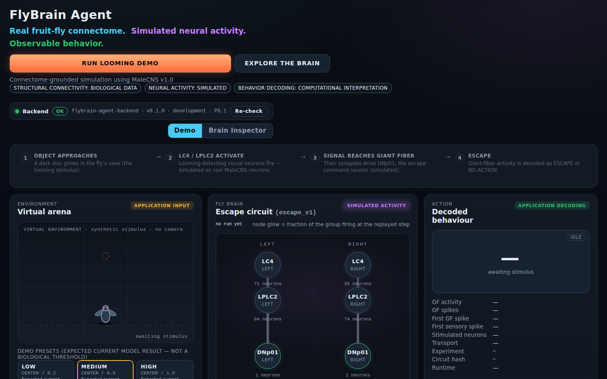
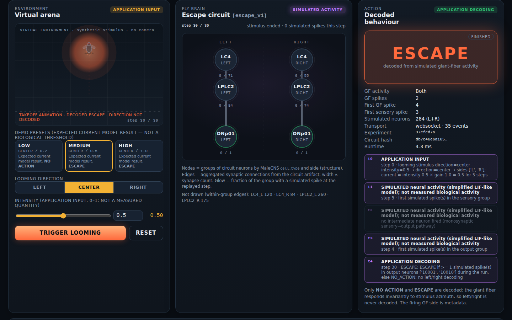
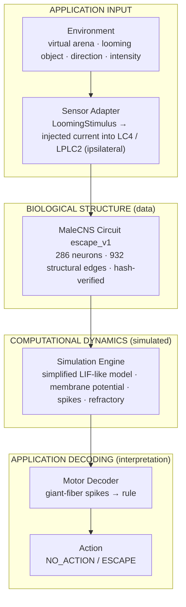
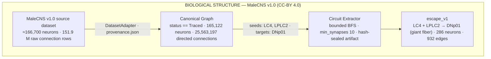
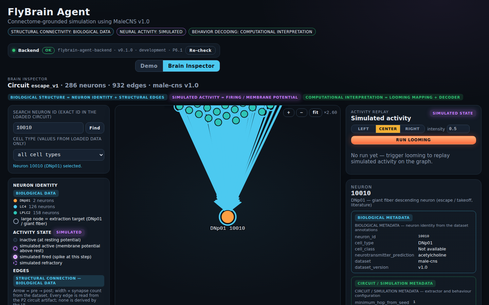
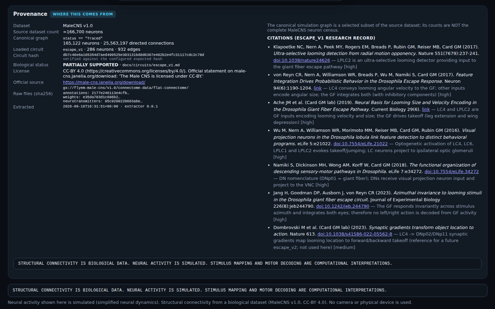

# FlyBrain Agent

**A connectome-grounded biological agent built from real *Drosophila* neural connectivity and simplified simulated neural dynamics.**

[](https://github.com/hoyoboy0726123/Fly-Brain-Agent/actions/workflows/ci.yml)

-brightgreen)




> **Real fruit-fly connectome. Simulated neural activity. Observable behavior.**
> Connectome-grounded simulation using MaleCNS v1.0.
>
> STRUCTURAL CONNECTIVITY IS BIOLOGICAL DATA. NEURAL ACTIVITY IS SIMULATED. STIMULUS MAPPING AND MOTOR DECODING ARE COMPUTATIONAL INTERPRETATIONS.

## What happens when you click RUN LOOMING DEMO

1. **OBJECT APPROACHES** — a dark disc grows in the virtual fly's view (a *looming* stimulus, the classic trigger of the fly's escape reflex). *Application input.*
2. **LC4 / LPLC2 ACTIVATE** — 284 looming-detecting visual projection neurons receive current. Their identities and their synapses come from the MaleCNS v1.0 connectome; their spikes are produced by a simplified model. *Simulated.*
3. **SIGNAL REACHES GIANT FIBER** — the structural synapses onto DNp01, the giant-fiber escape command neuron (one per side), drive it to fire. *Simulated on biological structure.*
4. **ESCAPE** — giant-fiber spikes are decoded into `ESCAPE` (or `NO_ACTION`); the virtual fly takes off. *Computational interpretation.*



Every number on screen is traceable: the Fly Brain panel replays the backend's per-step simulated activity, the Action panel shows the decoded result with the giant-fiber side as metadata only, and the [Brain Inspector](#brain-inspector) exposes the neurons, edges and provenance behind it.

## Architecture

**Runtime path of one demo run** — three layers that never blur into each other:



**Where the circuit comes from** — biological data only, transformed by inspectable, deterministic tooling:



The canonical graph is a selected subset of the source dataset; **165,122 is the canonical graph size, not the MaleCNS neuron census** (see [Data Provenance](#data-provenance)).

## Quick Start

Prerequisites: Python 3.11+, Node.js 20.19+ / 22.12+, `make` (or use the Python launcher directly).

```bash
git clone https://github.com/hoyoboy0726123/Fly-Brain-Agent.git
cd Fly-Brain-Agent
make install                  # backend/.venv (pip install -e backend[dev]) + frontend/node_modules
make demo                     # validates, starts FastAPI + Vite, prints the URLs; Ctrl+C stops both
```

`make demo` is `python scripts/run_demo.py` (works with any interpreter that has the backend installed, on macOS / Linux / Windows). Before starting it checks that the escape config and the **committed** `escape_v1` circuit artifact exist, that the artifact passes its integrity check and matches the configured hash, and that the frontend dependencies are installed — and refuses to start with an explicit message otherwise (it never falls back to synthetic data):

```
FlyBrain Agent cannot start:
  * escape_v1 circuit artifact is missing (data/circuits/escape_v1.json).
      Run: git checkout -- data/circuits/escape_v1.json   (the artifact is committed)  or  make build-escape-config
```

Then open **http://127.0.0.1:5173**:

| | |
|---|---|
| **RUN LOOMING DEMO** | runs the selected preset (MEDIUM by default) and replays the result |
| Presets | **LOW** CENTER / 0.2 → expected current model result **NO ACTION** · **MEDIUM** CENTER / 0.5 → **ESCAPE** · **HIGH** CENTER / 1.0 → **ESCAPE** (model outcomes, *not* biological thresholds; direction and intensity stay fully manual) |
| **EXPLORE THE BRAIN** | opens the [Brain Inspector](#brain-inspector) (`/#inspector`) |
| API docs | http://127.0.0.1:8000/docs |

Useful commands: `make demo-check` (validation only), `make test`, `make smoke`, `make screenshots`, `make help`. Details in [docs/DEVELOPMENT.md](docs/DEVELOPMENT.md). The raw MaleCNS files are **not** needed to run the demo, the inspector or the tests; they are only needed to rebuild the artifact (`make normalize`, `make build-escape-config`, see [DATA.md](DATA.md)).

## Scientific Boundaries

FlyBrain Agent keeps three kinds of information visibly separate — in the UI, in every API payload and in the code layout (`backend/app/connectome` + `circuits` / `simulation` / `sensors` + `motor` + `behavior`).

| BIOLOGICAL DATA (MaleCNS v1.0) | SIMULATED (simplified LIF-like model) | COMPUTATIONAL INTERPRETATION (application) |
|---|---|---|
| neuron identities (`neuron_id`, `cell_type`, neurotransmitter *prediction*) | membrane potential | looming stimulus mapping (intensity × gain → injected current) |
| structural connectivity (pre → post edges) | firing events | motor decoding (giant-fiber spikes → rule) |
| synapse counts | refractory state | `ESCAPE` / `NO_ACTION` |

**BIOLOGICAL CIRCUIT STATUS: PARTIALLY SUPPORTED.** The sensory types (LC4, LPLC2), the output neuron (DNp01 / giant fiber) and the direct ipsilateral synaptic path are supported by the literature and verified in the connectome; the model dynamics are unsigned, excitatory-only with computational parameters; the giant fiber is azimuth-invariant, so no left/right escape is decoded; literature was verified by metadata only. Full record: [docs/circuits/escape_v1.md](docs/circuits/escape_v1.md), [NEUROSCIENCE.md](NEUROSCIENCE.md).

What this project does **not** claim: that simulated activity equals real fly neural activity, that any edge was invented or tuned, that the complete fly brain is simulated, or that a behaviour was reproduced. Intensity is a dimensionless application input, not a measured quantity; "expected current model result" is what the current parameters produce.

## Brain Inspector



The inspector draws the whole `escape_v1` circuit (286 neurons / 932 edges — never the 165,122-neuron canonical graph) with D3: zoom, pan, hover, click a neuron or an edge, search an exact neuron id (e.g. `10010`) or filter by cell type.

- **Neuron inspector** — `BIOLOGICAL METADATA` (neuron_id, cell_type, cell_class, neurotransmitter_prediction, dataset, dataset_version; "Not available" when the artifact has no value) / `CIRCUIT / SIMULATION METADATA` (minimum_hop_from_seed, is_seed, is_target, side, role) / `SIMULATED STATE` (membrane potential, fired, refractory at the replayed step) / **Connections within loaded circuit** with upstream / downstream highlight.
- **Edge inspector** — `BIOLOGICAL STRUCTURAL CONNECTION`: FROM, TO, synapse_count (*biological structural observation*), dataset, dataset_version, circuit_id, circuit_hash — and, separately, the *computational simulation weight* (`log1p(synapse_count) × scale`).
- **Activity replay** — RUN LOOMING, PLAY / PAUSE / STEP / RESET and a timeline slider over the per-neuron simulated state of the last run.

Neuron colour encodes identity (biological data); rings and glow encode simulated state — two channels that are never mixed.

## Data Provenance



| | Source dataset | Canonical simulation graph | Loaded circuit |
|---|---|---|---|
| what | MaleCNS v1.0 as published | the subset this project simulates | `escape_v1` |
| neurons | ≈166,700 (paper: 166,691) | 165,122 (canonical subset, **not** the census) | 286 |
| rule | — | `status == "Traced"` | LC4 + LPLC2 → DNp01, max 1 hop, ≥ 10 synapses |
| connections | 151,856,684 raw body→body rows | 25,563,197 directed edges | 932 |

Every derived artifact carries its provenance: `data/processed/provenance.json` (raw files with sha256, license, source and download URLs, source-dataset vs canonical-graph counts), `data/circuits/escape_v1.json` (hash-sealed circuit with the same provenance block and the extractor configuration) and `backend/app/behavior/configs/escape_v1.json` (expected circuit hash, citations, limitations). The inspector's Provenance panel and `GET /api/circuits/escape_v1/provenance` show all of it.

**Dataset attribution.** MaleCNS v1.0 is the male *Drosophila melanogaster* central nervous system connectome released by HHMI Janelia (FlyEM) with the University of Cambridge, MRC LMB and Google Research. It is licensed under **Creative Commons Attribution 4.0 (CC-BY 4.0)** — official statement: *"The Male CNS is licensed under CC-BY."* (https://male-cns.janelia.org/download/); bulk files: `gs://flyem-male-cns/v1.0/connectome-data/flat-connectome/`. FlyBrain Agent does not own, modify or redistribute the dataset: raw files are never committed (`data/raw/` is git-ignored), and the derived artifacts committed here cite the dataset, version, license and file digests. Verification record: [docs/dataset_research.md](docs/dataset_research.md); policy: [DATA.md](DATA.md).

**Project code license.** Separate from the dataset license: FlyBrain Agent's source code is released under the **Apache License 2.0** (see [License](#license)). Apache-2.0 applies to the project code only; it does not replace, override or relicense the MaleCNS dataset, which stays under CC-BY 4.0.

## Testing

```bash
make test           # backend pytest + frontend typecheck
make lint           # ruff check + format check (backend + scripts)
make build-frontend # production build (frontend/dist)
make smoke          # health · fixture data · circuit · simulation · escape demo · web demo API · embodiment · threat lab · intervention · Playwright
make demo-smoke     # start both servers via the launcher, verify, stop
```

| Suite | What it covers | Data used |
|---|---|---|
| `pytest` (backend) | dataset adapters, canonical-graph guards, extractor, simulation engine, escape pipeline, escape API, circuits API (incl. "every served edge exists in the artifact"), embodiment loop, Threat Lab API (timeline = P7.0 loop records, determinism, limits, failure → no timeline), computational firing suppression (structure unchanged, targets never fire, NONE = legacy), A/B intervention API (matched conditions verified), launcher validation | synthetic fixture + committed `escape_v1` artifact |
| Playwright (frontend) | health smoke, P5 demo, landing / presets / story, P6 inspector, P7.1 Virtual Threat Lab (replay = backend record, ESCAPE marker, body moves only per `BodyState`, NO RESULT on failure), P7.2 Neural Intervention Lab (one cursor for both trials, SUPPRESSED groups structurally present, backend-derived actions / GF / body, disclaimers, literature separated from result), screenshot specs — happy paths on the live backend, error states intercepted | committed `escape_v1` artifact |
| smoke scripts | health, fixture inspection, fixture extraction / simulation (production steps skipped without data), escape demo, web demo REST + WebSocket + inspector API, embodiment loop, Threat Lab API over HTTP, CONTROL vs SILENCE_LPLC2 over the A/B API | fixture + committed artifact |

**Continuous integration** ([`.github/workflows/ci.yml`](.github/workflows/ci.yml)) runs on every push and pull request: backend (Python 3.11 and 3.12: ruff, pytest, smoke scripts), frontend (Node 22: `npm ci`, typecheck, production build) and end-to-end (launcher `--check` and `--smoke`, then the full Playwright suite against the live backend with the committed artifact). **CI never downloads the MaleCNS dataset**; steps that need the raw data (`make normalize`, technical extraction / simulation on the canonical graph, `make build-escape-config`) are local-only and skip themselves in CI.

## Embodiment architecture (P7.0)

P7.0 adds the closed-loop foundation `World → Sensor → Brain → Motor → Body → World` in
`backend/app/embodiment/` (frozen domain models, `WorldAdapter` / `SensorAdapter` /
`MotorAdapter` / `BodyAdapter` interfaces, `EmbodiedAgentLoop`, a deterministic
`SimpleWorldAdapter` + `SimpleBodyAdapter` labelled **SIMPLIFIED COMPUTATIONAL BODY**). The
existing escape_v1 brain is reused unchanged; the brain never touches body coordinates; no
direction is decoded from giant-fiber activity. Backend-only and additive (no new endpoints,
no Three.js, no FlyGym yet). Try `make smoke-embodiment`; design in
[docs/EMBODIMENT.md](docs/EMBODIMENT.md).

> Structural connectivity is biological data. Neural activity is simulated. Virtual sensing,
> motor mapping, body dynamics, and world physics are computational interpretations.

## Virtual Threat Lab (P7.1)

The third tab, **Virtual Threat Lab**, makes the P7.0 closed loop visible, interactive and
replayable. Press **RUN EXPERIMENT**: the backend runs `World → Sensor → Brain → Motor → Body
→ World` for up to 200 loop steps (`POST /embodiment/run`) and returns the whole timeline;
the browser then replays it (PLAY / PAUSE / STEP / slider / RESET, ⚡ ESCAPE markers). Every
panel — the top-down arena, DISTANCE / LOOMING INPUT / BODY POSITION / ACTION, the WORLD /
BODY / SENSOR read-outs, the LC4 / LPLC2 → DNp01 brain panel with per-neural-step spike bars,
and the WORLD ↓ SENSOR ↓ BRAIN ↓ MOTOR ↓ BODY story — shows the state recorded at the selected
step. **The frontend never generates behaviour**: no rule such as "intensity > 0.5 ⇒ LC4
active" exists in the UI, the fly moves only where the recorded `BodyState` moved, and a
failed run shows **NO RESULT** (never a default ESCAPE, never synthesised steps). The short
tween between two recorded steps is presentation only. Only world geometry (start distance,
approach speed, azimuth), loop length and the seed can be changed; neural parameters are not
exposed. Neural intervention (silence / stimulate / lesion) is **P7.2 — not implemented**.

| Screenshot | State |
|---|---|
| [`docs/screenshots/threatlab-A-initial.png`](docs/screenshots/threatlab-A-initial.png) | WAITING FOR EXPERIMENT (no fake activity, no fly, no object) |
| [`docs/screenshots/threatlab-B-approaching.png`](docs/screenshots/threatlab-B-approaching.png) | object approaching, NO_ACTION |
| [`docs/screenshots/threatlab-C-escape-event.png`](docs/screenshots/threatlab-C-escape-event.png) | ESCAPE decoded (loop step 16) |
| [`docs/screenshots/threatlab-D-post-escape-body.png`](docs/screenshots/threatlab-D-post-escape-body.png) | body airborne one loop step later |
| [`docs/screenshots/threatlab-E-replay-escape-step.png`](docs/screenshots/threatlab-E-replay-escape-step.png) | replay jumped to the ⚡ marker |

```bash
make smoke-threat-lab      # scripts/smoke_threat_lab.py: /embodiment/config + /embodiment/run over HTTP
```

API: `GET /embodiment/config` (experiment, world / sensor / body / motor / loop configs, timing,
circuit, dataset, labels, scientific boundaries, disclaimer, request limits) and
`POST /embodiment/run` (`seed`, `max_steps ≤ 200`, `world.{start_distance, approach_speed,
azimuth_deg}`; unknown or neural fields → 422). Details in
[docs/EMBODIMENT.md §10](docs/EMBODIMENT.md#10-virtual-threat-lab-p71).

## Neural Intervention Lab (P7.2)

The fourth tab, **Neural Intervention Lab**, runs the same virtual threat twice under
verified matched conditions — **CONTROL** and one **computational intervention** — and
replays both with one cursor. The intervention is **COMPUTATIONAL FIRING SUPPRESSION**
applied inside the simulation engine (`InterventionConfig`, layer COMPUTATIONAL DYNAMICS):

> Computational intervention suppresses simulated firing of selected neurons while
> preserving the biological structural connectivity.

For a targeted neuron the id, edges and synapse counts stay in the circuit, input is still
accumulated and the membrane still integrates; when it reaches threshold no spike is
emitted (no reset, no refractory period, no propagation). Targets (`SILENCE LC4`,
`SILENCE LPLC2`, `SILENCE LC4 + LPLC2`) are resolved from the circuit artifact's own
cell-type annotations — no id is invented, no count is assumed — and recorded in
provenance. Nothing downstream is touched: the decoder, motor mapping, body and world are
unchanged, no expected outcome is encoded, and the simulation decides whether ESCAPE still
happens. Suppressed groups are drawn crossed-out with **STRUCTURE PRESENT · SIMULATED FIRING
SUPPRESSED**; the Brain Inspector shows the intervention state of a selected neuron.

The literature that motivates the targets (Ache et al. 2019, *Current Biology*, DOI
10.1016/j.cub.2019.01.079: LC4 → GF angular-velocity contribution, LPLC2 → GF angular-size
contribution, experimental LPLC2 silencing impaired GF-mediated escape) is shown as
**BIOLOGICAL EVIDENCE**, separated from the **CURRENT COMPUTATIONAL RESULT**; the simulation
result is never presented as validation of that study.

> Neural interventions in this lab are computational manipulations of simulated neural
> dynamics. They do not reproduce a specific biological silencing, optogenetic, genetic,
> pharmacological, or lesion technique. Biological structural connectivity remains unchanged.

Observed with the current model (default world, seed 0, 30 loop steps; reported as is):
suppressing LC4 alone or LPLC2 alone left the first ESCAPE at loop step 16; suppressing
both removed the ESCAPE (GF never fired). Structure before / after: 286 neurons, 932 edges,
18,843 synapses, same hash.

| Screenshot | State |
|---|---|
| [`docs/screenshots/intervention-A-initial.png`](docs/screenshots/intervention-A-initial.png) | lab before a comparison |
| [`docs/screenshots/intervention-B-silence-lplc2.png`](docs/screenshots/intervention-B-silence-lplc2.png) | CONTROL vs SILENCE LPLC2 at the control ESCAPE step (LPLC2 crossed out, structure present) |
| [`docs/screenshots/intervention-C-comparison.png`](docs/screenshots/intervention-C-comparison.png) | matched conditions and descriptive differences for LC4 + LPLC2 |

```bash
make smoke-intervention    # scripts/smoke_intervention.py: CONTROL vs SILENCE_LPLC2 over the A/B API
```

API: `GET /embodiment/intervention/config` (resolved selectors, semantics, disclaimers,
literature, structural signature) and `POST /embodiment/intervention/compare`
(`intervention`, `seed`, `max_steps`, `world`) → `control`, `intervention` (config, resolved
targets, experiment, provenance) and `comparison` (verified `matched_conditions`,
descriptive `differences`, `synchronization`, `structural_integrity`). Details in
[docs/EMBODIMENT.md §11](docs/EMBODIMENT.md#11-neural-intervention-lab-p72).

## Roadmap

- **Release:** v0.1.0 tag and GitHub Release — pending explicit authorization by the project owner (license decision resolved: Apache-2.0).
- P7.0 — embodiment architecture (done, approved); P7.1 — Virtual Threat Lab (done, approved); P7.2 — computational neural intervention lab, SUPPRESS_FIRING only (done, awaiting review); P7.3+ — further intervention mechanisms (STIMULATE / CLAMP / LESION / synaptic edits are documented, not implemented), FlyGym / NeuroMechFly adapters; food seeking only after its own research gate.
- P8 — webcam stimulus adapter; P9 — safe robot / physical adapter.
- Candidate `escape_v2`: DNp02 / DNp04 / DNp11 (forward / backward takeoff) once directional decoding is evidence-backed; contralateral giant-fiber inputs.
- Inspector: per-neuron voltage traces, snapshot export / import.

See [CHANGELOG.md](CHANGELOG.md) for the v0.1.0 entry and [PROGRESS.md](PROGRESS.md) for the phase-by-phase reports.

## License

Two separate licensing domains — they must not be confused:

| | Applies to | License |
|---|---|---|
| **PROJECT CODE** | FlyBrain Agent source code in this repository: `backend/`, `frontend/`, `scripts/`, tests, tooling and project documentation written for this project | **Apache License 2.0** — see [`LICENSE`](LICENSE) (SPDX: `Apache-2.0`) |
| **SOURCE DATASET** | MaleCNS v1.0 (HHMI Janelia FlyEM and collaborators) and every value derived from it — neuron ids, cell types, synapse counts, the `escape_v1` circuit artifact, `provenance.json` | **CC-BY 4.0** — the dataset's own license; attribution required (see [Data Provenance](#data-provenance)) |

The Apache-2.0 license covers FlyBrain Agent's code only. It does **not** replace, override or relicense the MaleCNS dataset or the data-derived artifacts; those remain under CC-BY 4.0 with the attribution above. FlyBrain Agent does not own MaleCNS data.

## Project documents

[START_HERE.md](START_HERE.md) · [PRD.md](PRD.md) · [SDD.md](SDD.md) · [DATA.md](DATA.md) · [NEUROSCIENCE.md](NEUROSCIENCE.md) · [AGENTS.md](AGENTS.md) · [TASKS.md](TASKS.md) · [PROGRESS.md](PROGRESS.md) · [docs/DEVELOPMENT.md](docs/DEVELOPMENT.md) · [docs/dataset_research.md](docs/dataset_research.md) · [docs/circuits/escape_v1.md](docs/circuits/escape_v1.md) · [docs/EMBODIMENT.md](docs/EMBODIMENT.md) · [docs/PROJECT_BRIEF.md](docs/PROJECT_BRIEF.md)（原始專案簡介，中文）
