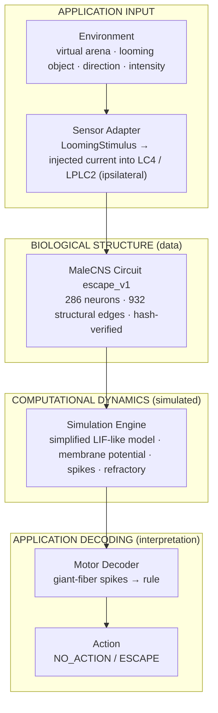
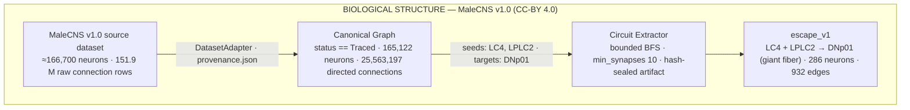

# FlyBrain Agent

**A connectome-grounded biological agent built from real *Drosophila* neural connectivity and simplified simulated neural dynamics.**

[](https://github.com/hoyoboy0726123/Fly-Brain-Agent/actions/workflows/ci.yml)

-brightgreen)


> **Real fruit-fly connectome. Simulated neural activity. Observable behavior.**
> Connectome-grounded simulation using MaleCNS v1.0.
>
> STRUCTURAL CONNECTIVITY IS BIOLOGICAL DATA. NEURAL ACTIVITY IS SIMULATED. STIMULUS MAPPING AND MOTOR DECODING ARE COMPUTATIONAL INTERPRETATIONS.

## What happens when you click RUN LOOMING DEMO

1. **OBJECT APPROACHES** — a dark disc grows in the virtual fly's view (a *looming* stimulus, the classic trigger of the fly's escape reflex). *Application input.*
2. **LC4 / LPLC2 ACTIVATE** — 284 looming-detecting visual projection neurons receive current. Their identities and their synapses come from the MaleCNS v1.0 connectome; their spikes are produced by a simplified model. *Simulated.*
3. **SIGNAL REACHES GIANT FIBER** — the structural synapses onto DNp01, the giant-fiber escape command neuron (one per side), drive it to fire. *Simulated on biological structure.*
4. **ESCAPE** — giant-fiber spikes are decoded into `ESCAPE` (or `NO_ACTION`); the virtual fly takes off. *Computational interpretation.*


Every number on screen is traceable: the Fly Brain panel replays the backend's per-step simulated activity, the Action panel shows the decoded result with the giant-fiber side as metadata only, and the [Brain Inspector](#brain-inspector) exposes the neurons, edges and provenance behind it.

## Architecture

**Runtime path of one demo run** — three layers that never blur into each other:



**Where the circuit comes from** — biological data only, transformed by inspectable, deterministic tooling:



The canonical graph is a selected subset of the source dataset; **165,122 is the canonical graph size, not the MaleCNS neuron census** (see [Data Provenance](#data-provenance)).

## Quick Start

Prerequisites: Python 3.11+, Node.js 20.19+ / 22.12+, `make` (or use the Python launcher directly).

```bash
git clone https://github.com/hoyoboy0726123/Fly-Brain-Agent.git
cd Fly-Brain-Agent
make install                  # backend/.venv (pip install -e backend[dev]) + frontend/node_modules
make demo                     # validates, starts FastAPI + Vite, prints the URLs; Ctrl+C stops both
```

`make demo` is `python scripts/run_demo.py` (works with any interpreter that has the backend installed, on macOS / Linux / Windows). Before starting it checks that the escape config and the **committed** `escape_v1` circuit artifact exist, that the artifact passes its integrity check and matches the configured hash, and that the frontend dependencies are installed — and refuses to start with an explicit message otherwise (it never falls back to synthetic data):

```
FlyBrain Agent cannot start:
  * escape_v1 circuit artifact is missing (data/circuits/escape_v1.json).
      Run: git checkout -- data/circuits/escape_v1.json   (the artifact is committed)  or  make build-escape-config
```

Then open **http://127.0.0.1:5173**:

| | |
|---|---|
| **RUN LOOMING DEMO** | runs the selected preset (MEDIUM by default) and replays the result |
| Presets | **LOW** CENTER / 0.2 → expected current model result **NO ACTION** · **MEDIUM** CENTER / 0.5 → **ESCAPE** · **HIGH** CENTER / 1.0 → **ESCAPE** (model outcomes, *not* biological thresholds; direction and intensity stay fully manual) |
| **EXPLORE THE BRAIN** | opens the [Brain Inspector](#brain-inspector) (`/#inspector`) |
| API docs | http://127.0.0.1:8000/docs |

Useful commands: `make demo-check` (validation only), `make test`, `make smoke`, `make screenshots`, `make help`. Details in [docs/DEVELOPMENT.md](docs/DEVELOPMENT.md). The raw MaleCNS files are **not** needed to run the demo, the inspector or the tests; they are only needed to rebuild the artifact (`make normalize`, `make build-escape-config`, see [DATA.md](DATA.md)).

## Scientific Boundaries

FlyBrain Agent keeps three kinds of information visibly separate — in the UI, in every API payload and in the code layout (`backend/app/connectome` + `circuits` / `simulation` / `sensors` + `motor` + `behavior`).

| BIOLOGICAL DATA (MaleCNS v1.0) | SIMULATED (simplified LIF-like model) | COMPUTATIONAL INTERPRETATION (application) |
|---|---|---|
| neuron identities (`neuron_id`, `cell_type`, neurotransmitter *prediction*) | membrane potential | looming stimulus mapping (intensity × gain → injected current) |
| structural connectivity (pre → post edges) | firing events | motor decoding (giant-fiber spikes → rule) |
| synapse counts | refractory state | `ESCAPE` / `NO_ACTION` |

**BIOLOGICAL CIRCUIT STATUS: PARTIALLY SUPPORTED.** The sensory types (LC4, LPLC2), the output neuron (DNp01 / giant fiber) and the direct ipsilateral synaptic path are supported by the literature and verified in the connectome; the model dynamics are unsigned, excitatory-only with computational parameters; the giant fiber is azimuth-invariant, so no left/right escape is decoded; literature was verified by metadata only. Full record: [docs/circuits/escape_v1.md](docs/circuits/escape_v1.md), [NEUROSCIENCE.md](NEUROSCIENCE.md).

What this project does **not** claim: that simulated activity equals real fly neural activity, that any edge was invented or tuned, that the complete fly brain is simulated, or that a behaviour was reproduced. Intensity is a dimensionless application input, not a measured quantity; "expected current model result" is what the current parameters produce.

## Brain Inspector


The inspector draws the whole `escape_v1` circuit (286 neurons / 932 edges — never the 165,122-neuron canonical graph) with D3: zoom, pan, hover, click a neuron or an edge, search an exact neuron id (e.g. `10010`) or filter by cell type.

- **Neuron inspector** — `BIOLOGICAL METADATA` (neuron_id, cell_type, cell_class, neurotransmitter_prediction, dataset, dataset_version; "Not available" when the artifact has no value) / `CIRCUIT / SIMULATION METADATA` (minimum_hop_from_seed, is_seed, is_target, side, role) / `SIMULATED STATE` (membrane potential, fired, refractory at the replayed step) / **Connections within loaded circuit** with upstream / downstream highlight.
- **Edge inspector** — `BIOLOGICAL STRUCTURAL CONNECTION`: FROM, TO, synapse_count (*biological structural observation*), dataset, dataset_version, circuit_id, circuit_hash — and, separately, the *computational simulation weight* (`log1p(synapse_count) × scale`).
- **Activity replay** — RUN LOOMING, PLAY / PAUSE / STEP / RESET and a timeline slider over the per-neuron simulated state of the last run.

Neuron colour encodes identity (biological data); rings and glow encode simulated state — two channels that are never mixed.

## Data Provenance


| | Source dataset | Canonical simulation graph | Loaded circuit |
|---|---|---|---|
| what | MaleCNS v1.0 as published | the subset this project simulates | `escape_v1` |
| neurons | ≈166,700 (paper: 166,691) | 165,122 (canonical subset, **not** the census) | 286 |
| rule | — | `status == "Traced"` | LC4 + LPLC2 → DNp01, max 1 hop, ≥ 10 synapses |
| connections | 151,856,684 raw body→body rows | 25,563,197 directed edges | 932 |

Every derived artifact carries its provenance: `data/processed/provenance.json` (raw files with sha256, license, source and download URLs, source-dataset vs canonical-graph counts), `data/circuits/escape_v1.json` (hash-sealed circuit with the same provenance block and the extractor configuration) and `backend/app/behavior/configs/escape_v1.json` (expected circuit hash, citations, limitations). The inspector's Provenance panel and `GET /api/circuits/escape_v1/provenance` show all of it.

**Dataset attribution.** MaleCNS v1.0 is the male *Drosophila melanogaster* central nervous system connectome released by HHMI Janelia (FlyEM) with the University of Cambridge, MRC LMB and Google Research. It is licensed under **Creative Commons Attribution 4.0 (CC-BY 4.0)** — official statement: *"The Male CNS is licensed under CC-BY."* (https://male-cns.janelia.org/download/); bulk files: `gs://flyem-male-cns/v1.0/connectome-data/flat-connectome/`. FlyBrain Agent does not own, modify or redistribute the dataset: raw files are never committed (`data/raw/` is git-ignored), and the derived artifacts committed here cite the dataset, version, license and file digests. Verification record: [docs/dataset_research.md](docs/dataset_research.md); policy: [DATA.md](DATA.md).

**Project code license.** Separate from the dataset license. *Not yet chosen* — the repository currently has no `LICENSE` file, which is an open decision for the project owner before a public release (see [Roadmap](#roadmap)).

## Testing

```bash
make test           # backend pytest + frontend typecheck
make lint           # ruff check + format check (backend + scripts)
make build-frontend # production build (frontend/dist)
make smoke          # health · fixture data · circuit · simulation · escape demo · web demo API · Playwright
make demo-smoke     # start both servers via the launcher, verify, stop
```

| Suite | What it covers | Data used |
|---|---|---|
| `pytest` (backend) | dataset adapters, canonical-graph guards, extractor, simulation engine, escape pipeline, escape API, circuits API (incl. "every served edge exists in the artifact"), launcher validation | synthetic fixture + committed `escape_v1` artifact |
| Playwright (frontend) | health smoke, P5 demo, landing / presets / story, P6 inspector, screenshot specs — happy paths on the live backend, error states intercepted | committed `escape_v1` artifact |
| smoke scripts | health, fixture inspection, fixture extraction / simulation (production steps skipped without data), escape demo, web demo REST + WebSocket + inspector API | fixture + committed artifact |

**Continuous integration** ([`.github/workflows/ci.yml`](.github/workflows/ci.yml)) runs on every push and pull request: backend (Python 3.11 and 3.12: ruff, pytest, smoke scripts), frontend (Node 22: `npm ci`, typecheck, production build) and end-to-end (launcher `--check` and `--smoke`, then the full Playwright suite against the live backend with the committed artifact). **CI never downloads the MaleCNS dataset**; steps that need the raw data (`make normalize`, technical extraction / simulation on the canonical graph, `make build-escape-config`) are local-only and skip themselves in CI.

## Roadmap

- **Decision pending (release blocker):** choose and add a project code license (`LICENSE`).
- P7 — second behaviour (food seeking): research gate first, same config + runner pattern.
- P8 — webcam stimulus adapter; P9 — safe robot / physical adapter.
- Candidate `escape_v2`: DNp02 / DNp04 / DNp11 (forward / backward takeoff) once directional decoding is evidence-backed; contralateral giant-fiber inputs.
- Inspector: per-neuron voltage traces, snapshot export / import.

See [CHANGELOG.md](CHANGELOG.md) for the v0.1.0 entry and [PROGRESS.md](PROGRESS.md) for the phase-by-phase reports.

## Project documents

[START_HERE.md](START_HERE.md) · [PRD.md](PRD.md) · [SDD.md](SDD.md) · [DATA.md](DATA.md) · [NEUROSCIENCE.md](NEUROSCIENCE.md) · [AGENTS.md](AGENTS.md) · [TASKS.md](TASKS.md) · [PROGRESS.md](PROGRESS.md) · [docs/DEVELOPMENT.md](docs/DEVELOPMENT.md) · [docs/dataset_research.md](docs/dataset_research.md) · [docs/circuits/escape_v1.md](docs/circuits/escape_v1.md) · [docs/PROJECT_BRIEF.md](docs/PROJECT_BRIEF.md)（原始專案簡介，中文）
