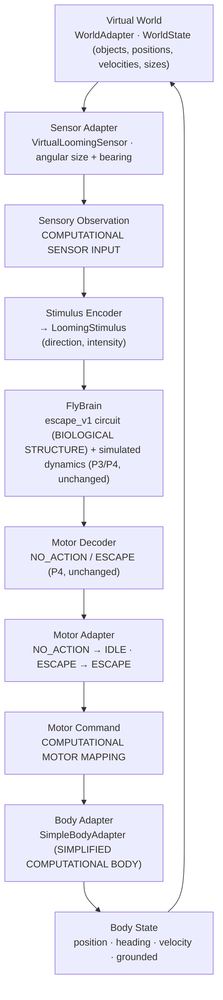

# Embodiment architecture (P7.0) and Virtual Threat Lab (P7.1)

> Structural connectivity is biological data. Neural activity is simulated.
> Virtual sensing, motor mapping, body dynamics, and world physics are computational
> interpretations.

P7.0 introduces the architecture that lets the existing FlyBrain neural system control a
body — first a simple virtual body, later a Three.js visual body, NeuroMechFly / FlyGym /
MuJoCo, and potentially a physical robot — **without rewriting the biological circuit or the
neural simulation layers**. It is a foundation: no visual world, no physics engine, no
locomotion and no new biology are part of it.

## 1. From open loop to closed loop

Up to P6 the system was `Stimulus → Brain → Action`. The embodiment layer closes the loop:



`EmbodiedAgentLoop` (`backend/app/embodiment/loop.py`) coordinates one step in this order and
contains no biological logic:

| # | call | layer |
|---|---|---|
| 1 | `WorldAdapter.get_state()` | virtual world |
| 2 | `BodyAdapter.get_state()` | virtual body |
| 3 | `SensorAdapter.observe(world_state, body_state)` → `SensoryObservation` | computational sensor mapping |
| 4 | `StimulusEncoder.encode(observation)` → P4 `LoomingStimulus` | application input |
| 5 | `EscapeExperiment.run(stimulus)` — existing P4 pipeline, unchanged | biological structure + simulated dynamics |
| 6 | `EscapeResult.decision` — existing P4 `MotorDecoder` output | application decoding |
| 7 | `MotorAdapter.translate(decision, clock)` → `MotorCommand` | computational motor mapping |
| 8 | `BodyAdapter.apply_command(command, dt)` | virtual body |
| 9 | `BodyAdapter.step(dt)` → `BodyState` | virtual body |
| 10 | `WorldAdapter.step(dt)` → `WorldState` | virtual world |
| 11 | `EmbodiedStepRecord` appended, clock advanced | record |

The brain receives **only** a `LoomingStimulus` and returns **only** an `EscapeResult`. Every
state model is frozen (immutable) and rejects NaN / Inf, so body coordinates (x, y, z,
heading, velocity) can change **only** inside a `BodyAdapter`.

## 2. Boundaries

| Layer | Examples | Where | Status |
|---|---|---|---|
| **BIOLOGICAL STRUCTURE** | MaleCNS neuron ids, cell types, structural edges, synapse counts | `app.connectome`, `app.circuits`, `data/circuits/escape_v1.json` | biological data (CC-BY 4.0) |
| **COMPUTATIONAL DYNAMICS** | membrane potential, simulated firing, refractory state, simulation weights | `app.simulation` | SIMULATED |
| **APPLICATION / EMBODIMENT INTERPRETATION** | looming object geometry, virtual sensor mapping, ESCAPE → body command, body velocity / position / heading, world "physics" | `app.embodiment`, `app.sensors`, `app.motor`, `app.behavior` | computational interpretation |

Wording used in code, payloads and docs:

- **BIOLOGICAL DATA** — MaleCNS structural connectivity.
- **SIMULATED NEURAL ACTIVITY** — simplified neural dynamics (P3).
- **COMPUTATIONAL SENSOR MAPPING** — virtual-world state converted into a neural stimulus (`SensoryObservation.interpretation_label = "COMPUTATIONAL SENSOR INPUT …"`).
- **COMPUTATIONAL MOTOR MAPPING** — decoded neural output converted into a body command (`MotorCommand.label`).
- **SIMPLIFIED COMPUTATIONAL BODY** — virtual-body movement is not claimed to reproduce real *Drosophila* biomechanics (`BodyState.label`, `SimpleBodyConfig.label`).

None of the embodiment values is a measured biological property.

## 3. Domain models (`backend/app/embodiment/models.py`)

All models are pydantic, `frozen=True`, `extra="forbid"`, finite-only.

| Model | Fields (minimum) | Notes |
|---|---|---|
| `Vector3` | x, y, z | dimensionless world units |
| `WorldObject` | object_id, object_type, position, velocity, size, properties | generic; no food / odor biology |
| `WorldState` | simulation_time, step_index, objects, metadata | unique object ids; label "VIRTUAL WORLD" |
| `BodyState` | position, heading (rad), linear_velocity, grounded, simulation_time, step_index | label SIMPLIFIED COMPUTATIONAL BODY; no legs |
| `SensoryObservation` | sensor_type, simulation_time, step_index, source, values, interpretation_label, metadata | label is a fixed literal: COMPUTATIONAL SENSOR INPUT |
| `MotorCommandType` | `IDLE`, `ESCAPE` | `FORWARD`, `TURN_LEFT`, `TURN_RIGHT`, `JUMP` are reserved names only (`RESERVED_FUTURE_COMMANDS`), **not** members |
| `MotorCommand` | command, magnitude 0..1, source_action, simulation_time, step_index, label, metadata | `metadata.direction_decoded = False` always |
| `SimulationClock` | dt, step_index, simulation_time | immutable; `advance()` returns a new clock |
| `TimingInfo` | loop_dt, neural_dt, neural_steps_per_loop_step, note | the two time bases, recorded separately |
| configs | `LoopConfig`, `SimpleWorldConfig`, `VirtualLoomingSensorConfig`, `EscapeMotorConfig`, `SimpleBodyConfig` | every config carries a "COMPUTATIONAL … PARAMETERS" label |
| records | `BrainStepSummary`, `EmbodiedStepRecord`, `EmbodimentProvenance`, `EmbodiedExperimentRecord` | reproducibility, see §6 |

## 4. Adapter interfaces

| Interface | Responsibilities | P7.0 implementation |
|---|---|---|
| `WorldAdapter` | `reset()`, `step(dt)`, `get_state()`; owns environment state | `SimpleWorldAdapter` — one looming object approaching the origin in a straight line at constant speed (deterministic, no randomness) |
| `SensorAdapter` | `observe(world_state, body_state) → SensoryObservation`; never touches the brain | `VirtualLoomingSensor` — nearest looming object: distance, bearing, angular size `2·atan(size / distance)`, `intensity = min(angular_size / saturation_angle, 1)`, direction left / center / right by bearing with a center band; out of the field of view → intensity 0 |
| `StimulusEncoder` | observation → existing P4 `LoomingStimulus` | reads `intensity` and `direction` from the observation |
| `BrainAdapter` (Protocol) | `run(stimulus) → EscapeResult` | satisfied by the existing P4 `EscapeExperiment`; no new brain code |
| `MotorAdapter` | `translate(decision, clock) → MotorCommand` | `EscapeMotorAdapter` — `NO_ACTION → IDLE`, `ESCAPE → ESCAPE`; giant-fiber side is metadata only, **no direction is decoded** |
| `BodyAdapter` | `reset()`, `apply_command(command, dt)`, `step(dt)`, `get_state()`; the only place body coordinates change | `SimpleBodyAdapter` — IDLE: no movement; ESCAPE: deterministic displacement along the current heading plus a brief airborne phase; an ESCAPE while airborne adds no second impulse |

### SimpleBodyAdapter — SIMPLIFIED COMPUTATIONAL BODY

Point body with a heading. Parameters (`SimpleBodyConfig`, computational, not measurements):
`escape_speed` 5.0 units/s along the heading, `escape_vertical_speed` 3.0 units/s,
`airborne_duration` 0.3 s, `ground_drag` 1.0/s. On landing the body returns to the ground
plane and stops. The escape direction is the body's current heading — an application
choice, because DNp01 / giant-fiber activity does not encode direction (Jang et al. 2023) and
current evidence does not justify `ESCAPE_LEFT` / `ESCAPE_RIGHT`.

## 5. Timing

- The loop uses **one common deterministic timestep** `LoopConfig.dt` (default 0.1 s of
  computational time) for the world and the body. Nothing depends on browser animation timing.
- Each loop step runs a **fresh** neural experiment of `neural_steps_per_loop_step` model
  steps (default: the escape config's `simulation_steps` = 30) with the model's own
  `SimulationConfig.dt` (1.0, a dimensionless model unit). Neural state is **not** carried
  across loop steps in P7.0 (the P4 runner builds a new engine per run).
- Both time bases are recorded in `EmbodimentProvenance.timing` (`loop_dt`, `neural_dt`,
  `neural_steps_per_loop_step`) and are not claimed to be physically related. Making them
  differ explicitly (e.g. neural sub-steps per loop step tied to `dt`) is a later decision.

## 6. Determinism and provenance

Given the same initial `WorldState`, `BodyState`, random seed, FlyBrain configuration and
sequence of observations, the closed-loop result is reproducible (tested: two runs produce
identical `EmbodiedExperimentRecord`s apart from wall-clock fields). `SimpleWorldAdapter` and
`SimpleBodyAdapter` draw no random numbers; the neural seed lives in `SimulationConfig`.

`EmbodimentProvenance` records: dataset, dataset_version, canonical graph selection rule,
circuit_id, circuit_hash, biological status, escape config version, simulation config,
loop random seed, world / sensor / motor / body adapter names and configs, loop config and
timing. `scripts/smoke_embodiment.py` writes a full record to
`data/simulations/embodiment_smoke.report.json`.

## 7. Future adapters (documented, NOT implemented in P7.0)

| Adapter | Role | Notes |
|---|---|---|
| `SimpleBodyAdapter` | point body for architecture tests and the P7.1 Virtual Threat Lab | **implemented** (P7.0) |
| `ThreeJSBodyAdapter` | drives a visual body in the browser from `BodyState` / `MotorCommand` | later phase; the browser renders, it never owns the state |
| `FlyGymAdapter` (NeuroMechFly / MuJoCo) | maps `MotorCommand` to a physics-based fly body and reads its pose back into `BodyState` | later phase; requires an explicit biomechanics provenance record |
| `RobotAdapter` | maps `MotorCommand` to a physical actuator with safety limits | later phase; safety gate first |

All of them implement the same `BodyAdapter` interface; the brain, decoder and motor
mapping stay unchanged.

## 8. What P7.0 does not do

No Three.js / 3D model, no MuJoCo / FlyGym / NeuroMechFly, no robotics, no food seeking, no
odor, no locomotion or six-leg gait, no collision physics, no new circuits, no new
endpoints (embodiment is additive and purely backend in P7.0; P7.1 adds the read-only
replay API below), no change to P0–P6 behaviour (`escape_v1` produces the same deterministic
results under the same configuration).

## 9. Running it

```bash
make smoke-embodiment      # scripts/smoke_embodiment.py: looming object → virtual fly, 30 loop steps
make smoke-threat-lab      # scripts/smoke_threat_lab.py: the same loop through the P7.1 API over HTTP
make test-backend          # includes backend/tests/test_embodiment.py and test_api_embodiment.py
make demo                  # then open the "Virtual Threat Lab" tab (or /#threat-lab)
```

## 10. Virtual Threat Lab (P7.1)

P7.1 makes the P7.0 loop **visible, interactive and replayable** without touching its
scientific logic. Roles of the three P7 sub-phases:

| Phase | Role | Status |
|---|---|---|
| P7.0 | embodiment architecture: models, adapters, `EmbodiedAgentLoop` | done |
| P7.1 | Virtual Threat Lab: replayable API + 2D arena / brain / loop-story UI | done |
| P7.2 | neural intervention in the lab (silence / stimulate / lesion groups) | planned, **not implemented** |

### 10.1 API (`backend/app/api/embodiment.py`)

`ThreatLabService` builds a **fresh** `EmbodiedAgentLoop` per request from the shared
escape_v1 brain (`EscapeService.experiment`, unchanged parameters) and the P7.0 adapters
(`SimpleWorldAdapter` with the requested world geometry, `VirtualLoomingSensor`,
`EscapeMotorAdapter`, `SimpleBodyAdapter`, `LoopConfig(dt=0.1, max_steps, random_seed)`).
It does not duplicate any embodiment logic: each timeline entry is the P7.0
`EmbodiedStepRecord` reshaped for replay.

| Endpoint | Returns |
|---|---|
| `GET /embodiment/config` | `experiment_name` (`virtual_threat_lab_v1`), `disclaimer`, `labels` (world physics COMPUTATIONAL · virtual sensing COMPUTATIONAL SENSOR INPUT · neural activity SIMULATED · structural connectivity BIOLOGICAL DATA · body SIMPLIFIED COMPUTATIONAL BODY · motor mapping COMPUTATIONAL MOTOR MAPPING), `scientific_boundaries`, `units_note`, world / sensor / body / motor / loop configs, `timing`, `circuit` (id, hash, dataset, neurons, edges, biological status, research document), `groups`, `group_edges`, `max_loop_steps` (200), `run_request_limits` |
| `POST /embodiment/run` | `experiment_id`, `created_at`, `disclaimer`, `labels`, `request`, `provenance` (P7.0 `EmbodimentProvenance`), `groups`, `initial_world`, `initial_body`, `timeline[]`, `outcome`, `runtime_seconds` |

Request (`extra="forbid"`; anything else, including any neural parameter, is a 422):
`seed ≥ 0`, `max_steps 1…200` (default 30), `world.start_distance 1…100`,
`world.approach_speed 0…50`, `world.azimuth_deg −180…180`. Errors: 422 `invalid_request`,
503 `circuit_unavailable` / `circuit_mismatch` / `config_unavailable` (same holder as
`/escape`), 500 `simulation_error` / `embodiment_error` (no partial timeline is returned),
504 `timeout`.

Each `timeline[i]` (`step_index = i`, 0-based; `simulation_time = i · dt`) carries:

| Key | Source (P7.0) | Content |
|---|---|---|
| `world` | state observed at loop step 1 (`WorldState`) | `simulation_time`, `step_index`, objects (`position`, `velocity`, `size`, type) — label COMPUTATIONAL WORLD |
| `body` | state observed at loop step 2 (`BodyState`) | `position`, `velocity`, `heading`, `grounded` — label SIMPLIFIED COMPUTATIONAL BODY |
| `sensor` | `SensoryObservation` (step 3) | `intensity`, `direction`, `distance`, `bearing_rad`, `angular_size_rad`, `visible` — label COMPUTATIONAL SENSOR INPUT |
| `brain` | `BrainStepSummary` (step 5–6) | `stimulus`, `neural_steps`, `neural_dt`, `group_fired_counts` (per group, per neural step — the P4 `group_activity`), `group_peak_fired`, `sensory_first_fire_step`, `first_output_fire_step`, `output_spike_count`, `fired_output_sides`, `firing_events`, `neurons_activated`, decoded `action` — label SIMULATED NEURAL ACTIVITY |
| `motor` | `MotorCommand` (step 7) | `command` (IDLE / ESCAPE), `magnitude`, `source_action`, `direction_decoded = false` — label COMPUTATIONAL MOTOR MAPPING |

Replay semantics: step *N* shows the geometry the sensor actually saw at *N* and the
brain / motor results computed from it; the body movement caused by that command is the
**observed body of step N + 1** (exactly the P7.0 order World → Sensor → Brain → Motor → Body
→ World). `outcome.events` marks `first_escape`, further `escape` steps and `landed` (first
observed step back on the ground). To keep payloads small, **no per-neuron state** is
returned (a 30-step run is ≈ 66 KiB); per-neuron traces remain in the P5 API and P6 inspector.

Additive P7.0 change for this: `BrainStepSummary` gained `sensory_first_fire_step` and
`group_fired_counts` (copied from the P4 result; no computation).

### 10.2 UI (`frontend/src/threatlab/`)

- `useThreatLab.ts` — loads the config, runs one experiment, keeps a replay cursor
  (`step`), PLAY / PAUSE / STEP / seek / RESET (rewinds to step 0). Phases: `idle`
  (WAITING FOR EXPERIMENT) → `running` → `ready` | `error` (NO RESULT). `?pace=<ms>` sets the
  replay pace (default 140 ms per loop step).
- `Arena.tsx` — SVG top-down world (no Three.js): object = `WorldState`, fly = `BodyState`
  (heading, airborne lift from `z`), fly's-eye inset radius = recorded `angular_size_rad`.
  Nothing is drawn before a run or after a failure. **Interpolation is presentation only**:
  a 110 ms CSS transition tweens between two recorded positions (disabled under
  `prefers-reduced-motion`); the DOM `data-x/y/z/heading/grounded` attributes always hold the
  exact recorded values (the Playwright tests assert on them).
- `Panels.tsx` — DISTANCE (units) / LOOMING INPUT / BODY POSITION / ACTION metrics and the
  WORLD / BODY / SENSOR read-outs; `ThreatLabBrain.tsx` — group nodes (identity = biological
  structure, glow = simulated peak activity of the loop step) plus per-neural-step spike bars,
  labelled SIMULATED NEURAL ACTIVITY; `LoopStory.tsx` — WORLD ↓ SENSOR ↓ BRAIN ↓ MOTOR ↓ BODY
  ↺ WORLD with the highlighted stage derived from the record (deepest stage carrying signal:
  looming input > 0, simulated spikes > 0, ESCAPE command, body moving); `ReplayControls.tsx`
  — RUN / PLAY / PAUSE / STEP / RESET, slider, ⚡ ESCAPE and ▼ landed markers (click = jump);
  `Boundaries.tsx` — labels, scientific boundaries, provenance and the disclaimer served by the
  backend; `ParamsForm.tsx` — world geometry, steps, seed only.
- Selecting step *N* (slider, markers, STEP, PLAY) re-renders every panel from
  `timeline[N]`; the P5 demo and the P6 inspector are untouched.

### 10.3 What P7.1 does not do

No neural intervention (silence / stimulate / lesion — P7.2), no food or odor, no Three.js /
3D body, no FlyGym / NeuroMechFly / MuJoCo, no six-leg gait, no robotics, no change to the
P0–P7.0 scientific logic, no frontend-generated activity or movement, no default outcome when
the backend fails. The v0.1.0 tag / release are not touched.
